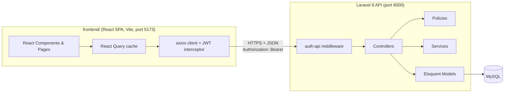
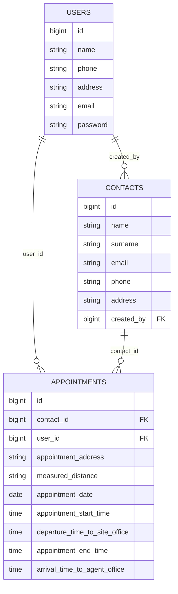
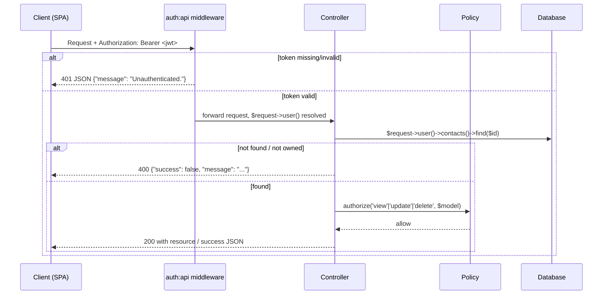
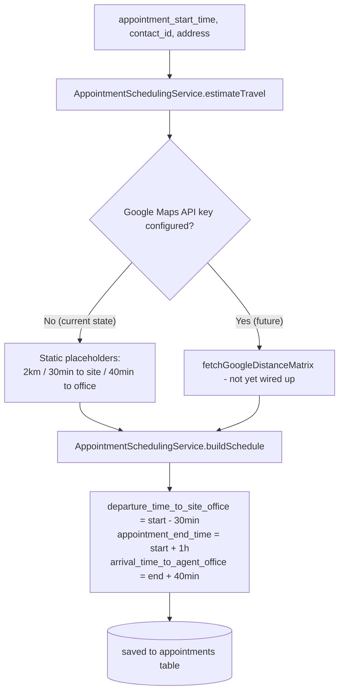

# Developer Guide — Real Estate Appointment System

This document is written so a developer joining the project for the first time can understand what the system is, how it's built, why it's structured the way it is, and how the modernization work was carried out. Flowcharts use [Mermaid](https://mermaid.js.org/) — they render natively on GitHub and in most modern Markdown viewers (VS Code with the Mermaid extension, GitLab, Obsidian, etc.).

---

## 1. What this project is

A small **appointment-scheduling system for real estate agents**. An agent registers, logs in, maintains a list of **contacts** (clients/leads), and schedules **appointments** against those contacts. Each appointment automatically computes a travel/return schedule (currently using placeholder distances — see §7).

The system has two parts, developed at different times and intentionally decoupled:

| Part | What it is | Where |
|---|---|---|
| **Backend API** | Laravel 8 JWT-secured REST API | repo root (`app/`, `routes/`, `database/`) |
| **Frontend SPA** | React 18 + Vite single-page app | `frontend/` |

They communicate only over HTTP (JSON + CORS + JWT bearer tokens) — the frontend is not built or served by Laravel in any way. You can run, deploy, or replace either side independently.

---

## 2. Project scope

### 2.1 Original state (before this modernization pass)

The project was inherited as a working-but-rough Laravel 8 API:

- Two controllers (`ContactController`, `AppointmentController`) containing inline validation, no authorization checks, and duplicated CRUD/error-handling code
- An abandoned duplicate controller (`__AppointmentController.php`) left in the codebase
- Both `laravel/sanctum` and `tymon/jwt-auth` installed, but only JWT actually wired up
- No `JWT_SECRET` configured — every protected route was one request away from a 500 crash
- A model relationship pointing at the wrong foreign key column
- A database column (`measured_distance`) that couldn't actually hold the value the code wrote to it
- No frontend at all — just a static, hand-written API documentation page (`resources/views/welcome.blade.php`)

### 2.2 Scope of this modernization

Agreed and executed in two phases:

**Phase A — Backend hardening** (no behavior change visible to a correctly-behaving client, but several real bugs fixed):
1. Critical security fixes
2. Dead code / unused dependency removal
3. Form Requests + a shared API response trait (kill duplicated validation/error code)
4. Authorization Policies
5. Service-layer extraction (move business logic out of controllers)
6. Small database fixes (FK constraint, index, factory)

**Phase B — New frontend**: a full React SPA covering the entire workflow (auth, contacts CRUD, appointments CRUD, dashboard), built as a separate project talking to the existing API.

### 2.3 Explicitly out of scope

- Upgrading Laravel 8 → a current LTS version (flagged, not done — see §7)
- A JavaScript test runner (Vitest/RTL) for the frontend
- Changing the `address`/`appointment_address` `max:7` business rule (assumed intentional, e.g. a postcode field)

---

## 3. System architecture



The frontend never touches the database or PHP code directly — everything goes through the documented REST API (§6).

---

## 4. Backend structure

```
app/
  Http/
    Controllers/
      AuthController.php          register/login/logout/refresh/profile
      ContactController.php       contacts CRUD (thin — delegates to Form Requests/Policies)
      AppointmentController.php   appointments CRUD + scheduling
    Requests/                     validation, one per action
      StoreContactRequest.php
      UpdateContactRequest.php
      StoreAppointmentRequest.php
      UpdateAppointmentRequest.php
    Resources/                    API response shaping
      ContactResource.php
      AppointmentResource.php
    Middleware/
      Authenticate.php           overridden: always JSON 401, no web-login redirect
  Models/
    User.php, Contacts.php, Appointments.php
  Policies/
    ContactPolicy.php, AppointmentPolicy.php   ownership checks (view/update/delete)
  Services/
    AppointmentSchedulingService.php           travel estimate + derived time math
  Traits/
    ApiResponser.php             successResponse() / errorResponse() / notFoundResponse()
  Providers/
    AuthServiceProvider.php      registers the two Policies
database/
  migrations/                    schema, including 3 fix-up migrations added during this pass
routes/
  api.php                        all API routes, prefixed /api/auth/...
  web.php                        just GET /docs (static API documentation page)
```

### Why each layer exists

- **Form Requests** centralize validation so controllers don't hand-roll `Validator::make()` calls with copy-pasted rules.
- **Resources** guarantee a consistent JSON shape (`{"data": {...}}` for reads) instead of ad-hoc arrays.
- **Policies** are a defense-in-depth authorization layer. The controllers already scope lookups through the authenticated user's own relation (e.g. `$request->user()->contacts()->find($id)`), so a stranger's ID already 404s — Policies exist so that *if* a future route or refactor ever queries the model directly (`Contacts::find($id)`), it's still blocked instead of silently leaking another user's data.
- **Services** hold business logic that doesn't belong in a controller or model — here, the appointment time-math and the (currently stubbed) distance lookup.
- **ApiResponser trait** removes the 9+ duplicated "not found" / "updated" / "deleted" JSON blocks that used to be copy-pasted across both controllers.

---

## 5. Database schema



Key constraints worth knowing as a developer:

- `contacts.created_by` and `appointments.contact_id` / `appointments.user_id` are real foreign keys with cascading deletes.
- `appointments.appointment_date` is indexed (added during this pass — it's the most common filter column).
- `password_resets.email` now has an FK to `users.email` (added during this pass — it had none before, allowing orphaned reset tokens).
- `measured_distance` is a `VARCHAR(20)`, **not** a decimal — it stores human strings like `"2km"`, not a number. This was a real schema/code mismatch that broke appointment creation entirely until fixed (see §7).

---

## 6. API reference

Base path: `/api/auth/...` (yes, the prefix applies to all routes, not just auth ones — that's an existing naming quirk, not a bug).

| Method | Path | Auth | Purpose |
|---|---|---|---|
| POST | `/login` | — | `{email, password}` → `{access_token, token_type, expires_in, user}` |
| POST | `/register` | — | `{name, email, phone, password, password_confirmation}` → `201 {message, user}` |
| POST | `/logout` | JWT | invalidates the current token |
| POST | `/refresh` | JWT | issues a new token |
| GET | `/user-profile` | JWT | returns the authenticated user |
| GET | `/contacts` | JWT | `{data: [...]}` — only the caller's own contacts |
| POST | `/contacts` | JWT | `{name, surname, email, phone, address}` → `{success, contact: {...}}` |
| GET | `/contact/{id}` | JWT | `{data: {...}}` |
| PUT | `/contact/{id}` | JWT | partial update, `{success}` |
| DELETE | `/contact/{id}` | JWT | `{success}` |
| GET | `/appointments` | JWT | `{data: [...]}` |
| POST | `/appointments` | JWT | `{contact_id, appointment_date, appointment_address, appointment_start_time}` → `{success, appointment: {...}}` |
| GET | `/appointment/{id}` | JWT | `{data: {...}}` |
| PUT | `/appointment/{id}` | JWT | partial update — re-derives the schedule if `appointment_start_time` is included |
| DELETE | `/appointment/{id}` | JWT | `{success}` |

**Validation errors are 422.** Two different shapes exist depending on the endpoint (a pre-existing quirk, documented rather than unified, to avoid touching more than necessary):
- `/login`, `/register` → the raw Laravel error bag directly: `{"email": ["..."]}`
- everything else (Form Request-backed) → the standard shape: `{"message": "...", "errors": {"email": ["..."]}}`

The frontend's `frontend/src/utils/errors.js` already handles both.

### Request flow for a protected endpoint



### Appointment creation/update scheduling logic



On **update**, this same recompute only runs if the request includes `appointment_start_time` — editing just the address or date doesn't touch the derived times.

---

## 7. What was found and fixed during this modernization (and why it matters to a new developer)

These weren't visible from reading the code — each was only caught by actually running the app, writing a real test, or driving it in a browser. Listed because a new developer should know the app's history of fragility, not just its current state.

| # | Bug | Where | How it was caught |
|---|---|---|---|
| 1 | `JWT_SECRET` never set in `.env` | environment | Writing the first auth regression test |
| 2 | `Contacts::user()` used the wrong FK column | `app/Models/Contacts.php` | Code review during assessment |
| 3 | JWT parsed in controller constructors, threw uncaught exceptions instead of 401 | both controllers | Same |
| 4 | `register()` double-JSON-encoded validation errors, wrong status code | `AuthController.php` | Building the frontend's Register page and checking the actual response shape |
| 5 | Default `Authenticate`/`Handler` crashed with 500 (not 401) for requests without an `Accept: application/json` header | framework defaults | A raw `curl` request during E2E verification (axios *does* set this header, but anything that doesn't would have hit this in production) |
| 6 | `measured_distance` was `decimal(8,2)` but the code writes `'2km'` | migration vs. controller | First real database write attempt during testing — appointment creation failed outright on MySQL |
| 7 | `UserFactory` missing required `phone` (NOT NULL, no default) | `database/factories/UserFactory.php` | `User::factory()->create()` failing in a test |
| 8 | `update()` never recomputed the derived schedule, only `create()` did | `AppointmentController.php` | Building the frontend's appointment-edit form and checking if editing the start time actually changed anything |
| 9 | React Query cache invalidation raced the UI's "switch back to read mode," briefly showing stale data after a successful edit | `frontend/src/hooks/use*.js` | Playwright E2E run, asserting the displayed value actually changed |

**Lesson embedded in this list**: almost every one of these was hidden behind "this code looks fine" and only surfaced by writing a test, running a migration, or clicking through a browser. Don't trust a Laravel/React app's correctness from a read-through alone — run it.

---

## 8. Running the project locally

### Backend

```bash
composer install
cp .env.example .env        # then fill in DB_*, set CORS_ALLOWED_ORIGINS if needed
php artisan key:generate
php artisan jwt:secret       # required - see bug #1 above
php artisan migrate
php artisan serve            # http://127.0.0.1:8000
```

Run tests: `php artisan test` (or `vendor/bin/phpunit`) — 12 tests covering auth, contacts/appointments CRUD, cross-user authorization, and the scheduling service.

### Frontend

```bash
cd frontend
npm install
cp .env.example .env          # VITE_API_BASE_URL, defaults to http://localhost:8000/api
npm run dev                   # http://localhost:5173
```

Both must be running simultaneously for the SPA to work. `npm run build` produces a static `dist/` you can deploy to any static host — it does not need Laravel to serve it.

---

## 9. Known limitations / recommended next steps

- **Laravel 8 is past end-of-life**, and `composer audit` reports active CVEs in `guzzlehttp/guzzle`, `guzzlehttp/psr7`, and `laravel/framework` itself (including a high-severity CRLF injection). Upgrading is a deliberate, separate project — not a drop-in patch on this version line.
- **Google Maps distance lookup is not wired up.** `AppointmentSchedulingService::fetchGoogleDistanceMatrix()` exists and reads `GOOGLE_MAPS_API_KEY` from `config/services.php`, but nothing calls it yet — `estimateTravel()` still returns static placeholders.
- **No JavaScript test suite.** The frontend was verified via a one-off Playwright script during development, not a committed test suite. Worth adding Vitest + React Testing Library if the frontend will keep growing.
- **`appointment_address`/`address` are capped at 7 characters** server-side. This looks like an unfinished postcode-only design (there's a `'cm27pj'`-shaped default value on `users.address`) — confirm intent with whoever owns the product before changing it.
