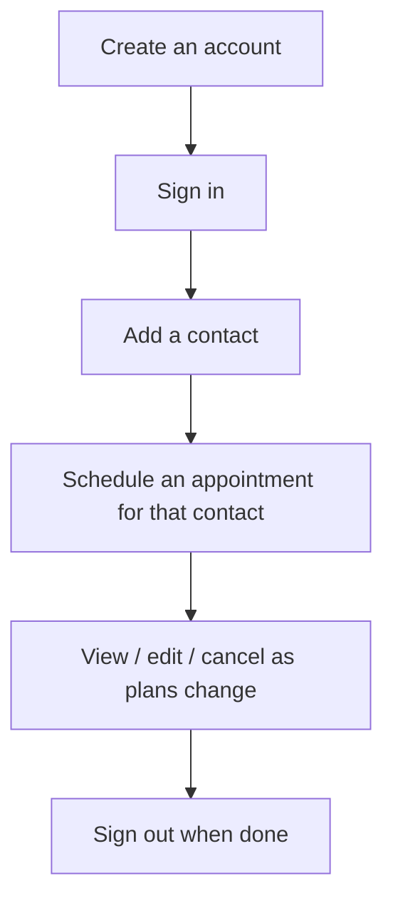

# User Guide — Appointments App

This guide is for real estate agents (and anyone managing their own contacts and appointments) using the application day to day. No technical knowledge is required.

---

## 1. What this app does

It helps you keep track of two things:

- **Contacts** — the people you work with (clients, leads)
- **Appointments** — scheduled meetings tied to a specific contact, with automatically calculated travel and return times

Everything you create is private to your account — no other user can see or edit your contacts or appointments.

---

## 2. Your overall workflow

---

## 3. Creating an account and signing in

1. Open the app. If you don't have an account yet, click **Register**.
2. Fill in your **name, email, phone number, and a password** (at least 6 characters), then confirm the password.
3. Click **Create account**. You'll see a confirmation message and be taken to the sign-in page.
4. Enter your **email and password**, click **Sign in**.

You'll land on the **Dashboard**, which shows a quick count of your contacts and appointments.

> If you enter the wrong email or password, you'll see an "Invalid email or password" message — just try again. If a field is missing or invalid (e.g. a malformed email), the form will point out exactly which field needs fixing.

---

## 4. Managing Contacts

### View your contacts
Click **Contacts** in the top menu. You'll see a list of everyone you've added, with their email and phone number. Use the **search box** at the top to filter by name or email as your list grows.

### Add a contact
1. From the Contacts page, click **New contact**.
2. Fill in **Name, Surname, Email, Phone, Address**.
   - Note: Address has a short length limit (it's intended for a postcode, not a full street address).
3. Click **Create contact**. You'll be returned to your contact list with the new entry visible.

### View / edit a contact
1. Click any contact in the list to open their details.
2. Click the **pencil icon** to edit. Update whichever fields you need and click **Save changes**.
3. Click anywhere outside the form, or **Cancel**, to discard changes without saving.

### Delete a contact
1. Open the contact, click the **trash icon**.
2. You'll be asked to confirm — this cannot be undone, so make sure before confirming.

---

## 5. Managing Appointments

### View your appointments
Click **Appointments** in the top menu. The list shows each appointment's contact, address, date, and start time, soonest first.

### Schedule a new appointment
1. From the Appointments page, click **New appointment**.
2. Choose a **Contact** from the dropdown — you can only schedule appointments for contacts you've already added.
3. Enter the **Date**, **Start time**, and **Appointment address**.
4. Click **Create appointment**.

Once created, the system automatically works out:
- **Estimated distance** to the appointment
- **Depart for site** — when you should leave your office
- **Appointment ends** — your start time plus one hour (the standard appointment length)
- **Back at office** — your estimated return time

### View / edit an appointment
1. Click an appointment in the list to see its full schedule.
2. Click the **pencil icon** to edit the contact, date, address, or start time.
3. If you change the **start time**, all the dependent times (depart, end, return) are automatically recalculated — you don't need to work them out yourself.
4. Click **Save changes**.

### Cancel/delete an appointment
1. Open the appointment, click the **trash icon**, and confirm.

---

## 6. Your profile

Click **Profile** in the top menu to see the account details you registered with (name, email, phone, address).

---

## 7. Dark mode

Click the **sun/moon icon** in the top menu to switch between light and dark themes. Your preference is remembered the next time you open the app.

---

## 8. Signing out

Click **Logout** in the top menu (or in the mobile menu, tap the hamburger icon first). You'll be returned to the sign-in page, and you'll need to sign in again to access your contacts and appointments.

---

## 9. Frequently asked questions

**Can someone else see my contacts or appointments?**
No. Everything you create is tied to your account only.

**What happens if I try to schedule an appointment for a contact that isn't mine?**
You can't — the contact dropdown only ever shows your own contacts.

**I deleted a contact or appointment by mistake — can I get it back?**
No, deletion is permanent. Always double-check before confirming a delete.

**Why is the address field so short?**
It's designed for a short code like a postcode rather than a full address. If this doesn't fit how you work, raise it with whoever manages the system — it's a deliberate (if perhaps outdated) design choice, not a bug.

**The app looks different on my phone — is that expected?**
Yes, the layout adapts to smaller screens (the top menu collapses into a hamburger icon), but all the same features are available.
